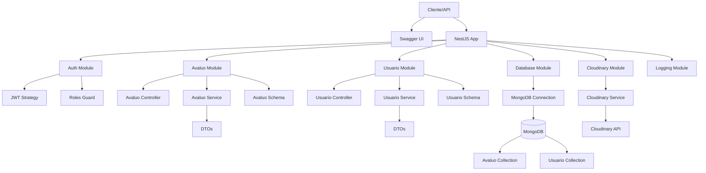

# API de Avaluos Inmobiliarios

Aplicación backend desarrollada en NestJS para la gestión de avaluos inmobiliarios. Incluye autenticación JWT, roles de usuario, subida de imágenes a Cloudinary, documentación Swagger y logging.

## Arquitectura

La aplicación sigue una arquitectura modular con los siguientes componentes principales:

- **Avaluo Module**: Gestión completa de avaluos inmobiliarios (CRUD).
- **Usuario Module**: Gestión de usuarios con roles.
- **Auth Module**: Autenticación y autorización JWT.
- **Cloudinary Module**: Servicio para subida de imágenes.
- **Database Module**: Conexión a MongoDB con Mongoose.
- **Logging Module**: Logging con Winston.

### Diagrama de Arquitectura



## Tecnologías

- **NestJS**: Framework principal.
- **MongoDB**: Base de datos NoSQL.
- **Mongoose**: ODM para MongoDB.
- **JWT**: Autenticación.
- **Cloudinary**: Almacenamiento de imágenes.
- **Winston**: Logging.
- **Swagger**: Documentación de APIs.
- **class-validator**: Validación de DTOs.

## Instalación

1. Clona el repositorio.
2. Instala dependencias: `npm install`.
3. Configura variables de entorno en `.env`.
4. Ejecuta la aplicación: `npm run start:dev`.

## Variables de Entorno

Crea un archivo `.env` con las siguientes variables:

```
MONGO_URI=mongodb://localhost:27017/avaluo
JWT_SECRET=your-secret-key
CLOUDINARY_CLOUD_NAME=your-cloud-name
CLOUDINARY_API_KEY=your-api-key
CLOUDINARY_API_SECRET=your-api-secret
```

## Uso

### Autenticación

- **POST /auth/login**: Inicia sesión con email y password. Retorna JWT token.

### Avaluos

- **GET /avaluo**: Lista todos los avaluos (requiere JWT y roles: admin, avaluador, usuario).
- **GET /avaluo/:id**: Obtiene un avaluo por ID.
- **POST /avaluo**: Crea un nuevo avaluo (roles: admin, avaluador).
- **PATCH /avaluo/:id**: Actualiza un avaluo (roles: admin, avaluador).
- **DELETE /avaluo/:id**: Elimina un avaluo (rol: admin).

### Usuarios

- **GET /usuario**: Lista usuarios (rol: admin).
- **GET /usuario/:id**: Obtiene usuario por ID.
- **POST /usuario**: Crea usuario (rol: admin).
- **PATCH /usuario/:id**: Actualiza usuario (rol: admin).
- **DELETE /usuario/:id**: Elimina usuario (rol: admin).

### Documentación

Accede a la documentación Swagger en: `http://localhost:3000/api`

## Roles de Usuario

- **admin**: Acceso completo a todas las funcionalidades.
- **avaluador**: Puede crear, leer y actualizar avaluos.
- **usuario**: Solo lectura de avaluos.

## Conocimiento de Avaluos Inmobiliarios

La aplicación maneja datos específicos de avaluos para diferentes tipos de inmuebles:

- **Lotes**: Área, forma, acceso.
- **Apartamentos**: Distribución interior, acabados.
- **Fincas**: Infraestructura ecológica, uso de suelo.

Los esquemas están diseñados para capturar información jurídica, características generales, inspección física y especificaciones constructivas según estándares de avaluos colombianos.

## Scripts

- `npm run start`: Modo producción.
- `npm run start:dev`: Modo desarrollo con hot reload.
- `npm run test`: Ejecuta pruebas unitarias.
- `npm run build`: Compila la aplicación.

## Licencia

Este proyecto está bajo la Licencia MIT.

## Project setup

```bash
$ npm install
```

## Compile and run the project

```bash
# development
$ npm run start

# watch mode
$ npm run start:dev

# production mode
$ npm run start:prod
```

## Run tests

```bash
# unit tests
$ npm run test

# e2e tests
$ npm run test:e2e

# test coverage
$ npm run test:cov
```

## Deployment

When you're ready to deploy your NestJS application to production, there are some key steps you can take to ensure it runs as efficiently as possible. Check out the [deployment documentation](https://docs.nestjs.com/deployment) for more information.

If you are looking for a cloud-based platform to deploy your NestJS application, check out [Mau](https://mau.nestjs.com), our official platform for deploying NestJS applications on AWS. Mau makes deployment straightforward and fast, requiring just a few simple steps:

```bash
$ npm install -g mau
$ mau deploy
```

With Mau, you can deploy your application in just a few clicks, allowing you to focus on building features rather than managing infrastructure.

## Resources

Check out a few resources that may come in handy when working with NestJS:

- Visit the [NestJS Documentation](https://docs.nestjs.com) to learn more about the framework.
- For questions and support, please visit our [Discord channel](https://discord.gg/G7Qnnhy).
- To dive deeper and get more hands-on experience, check out our official video [courses](https://courses.nestjs.com/).
- Deploy your application to AWS with the help of [NestJS Mau](https://mau.nestjs.com) in just a few clicks.
- Visualize your application graph and interact with the NestJS application in real-time using [NestJS Devtools](https://devtools.nestjs.com).
- Need help with your project (part-time to full-time)? Check out our official [enterprise support](https://enterprise.nestjs.com).
- To stay in the loop and get updates, follow us on [X](https://x.com/nestframework) and [LinkedIn](https://linkedin.com/company/nestjs).
- Looking for a job, or have a job to offer? Check out our official [Jobs board](https://jobs.nestjs.com).

## Support

Nest is an MIT-licensed open source project. It can grow thanks to the sponsors and support by the amazing backers. If you'd like to join them, please [read more here](https://docs.nestjs.com/support).

## Stay in touch

- Author - [Kamil Myśliwiec](https://twitter.com/kammysliwiec)
- Website - [https://nestjs.com](https://nestjs.com/)
- Twitter - [@nestframework](https://twitter.com/nestframework)

## License

Nest is [MIT licensed](https://github.com/nestjs/nest/blob/master/LICENSE).
